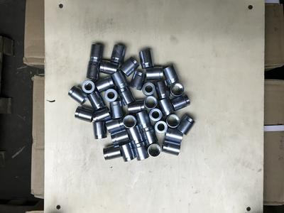

# MechPart-Detection-decision Pet Project

This is decision for automatic detection, segmentation and counting of mechanical parts based on [Mask RCNN](https://github.com/matterport/Mask_RCNN) and [Kivy](neural network.

If you want to reimplement this to your own task, please read tutorials for Mask_RCNN. For example [Balloon example](https://github.com/matterport/Mask_RCNN/tree/master/samples/balloon) or [Shapes example](https://github.com/matterport/Mask_RCNN/blob/master/samples/shapes/train_shapes.ipynb). 

Common steps for making decision:
1. Prepare data for your task.
2. Install necessary packages (Keras, Kivy, Numpy, Matplotlib, Opencv etc.) 
3. Use [VIA annotator](http://www.robots.ox.ac.uk/~vgg/software/via/) to  annotate objects on images.
4. Run Jupyter notebook, change paths to images, begin training of the neural network and validate results.
5. Implement weights of your model (.h5 file) into graphic interface. Just laydown .h5 file in root directory of this app.
6. If you want to build your app for Windows or Linux, use .spec file and pyinstaller package.

### Examples:

